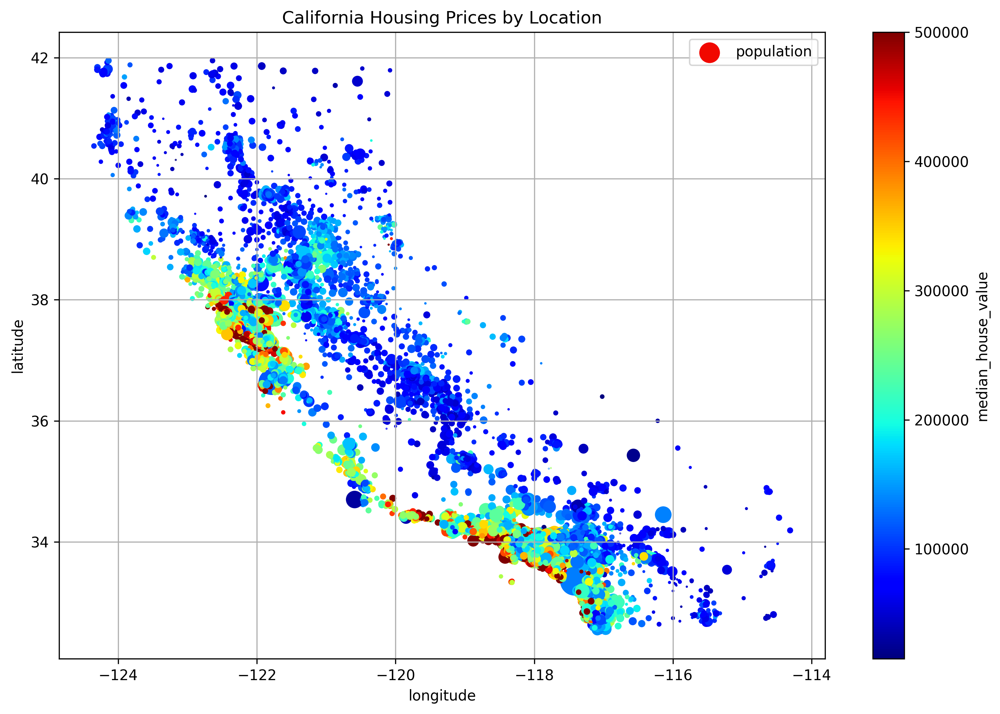
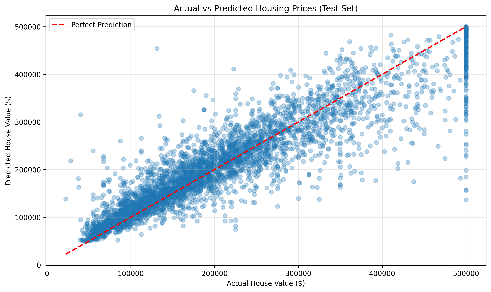
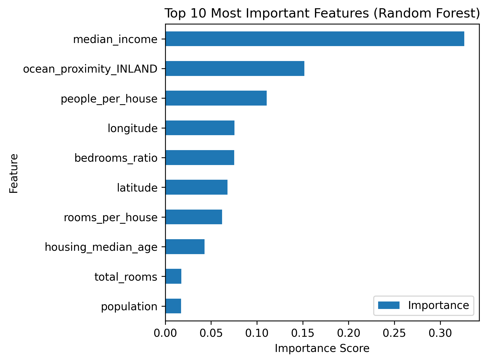
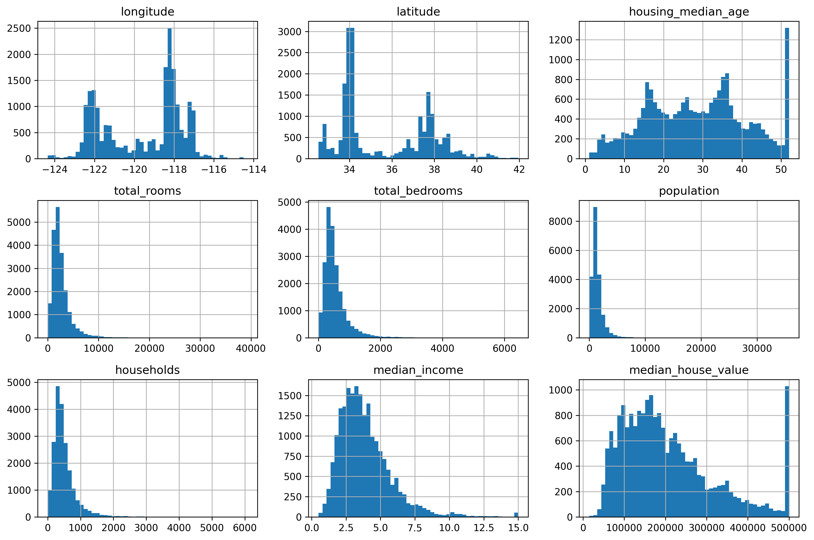
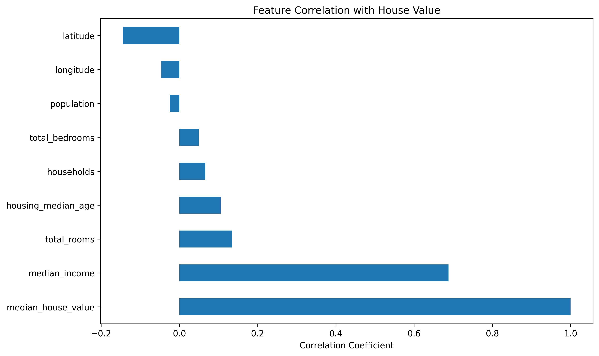
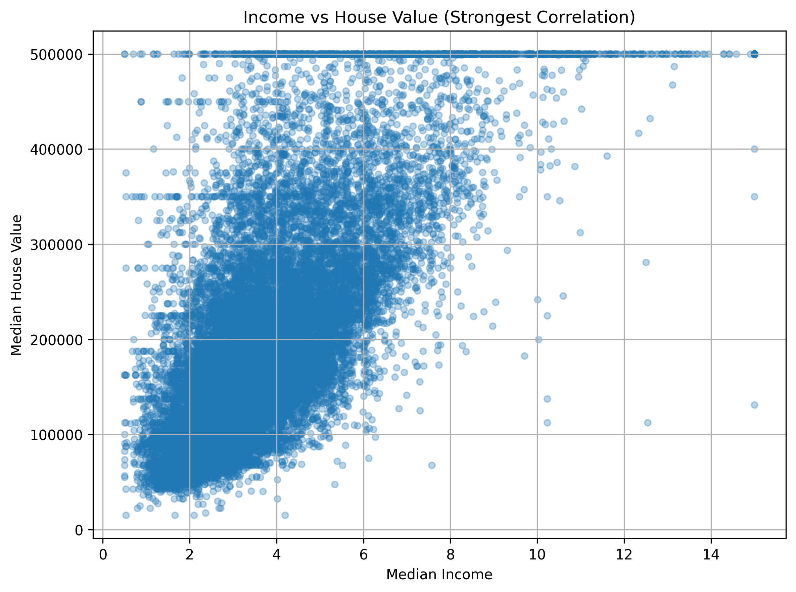
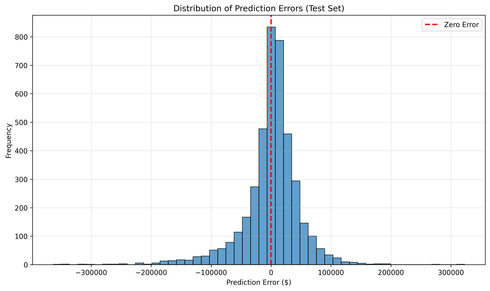

# 🏠 Intelligent California Housing Price Predictor
## End-to-End Machine Learning Pipeline

<div align="center">

[](https://www.python.org/downloads/)
[](https://scikit-learn.org/)
[](LICENSE)
[](https://jupyter.org/)
[](https://github.com/muk0644/california-housing-price-predictor)

</div>

> **A comprehensive machine learning project** for predicting median house values in California districts. Built with scikit-learn, this project demonstrates best practices in data preprocessing, feature engineering, model training, hyperparameter optimization, and statistical evaluation using the California Housing dataset (1990 Census).

---

## 📑 Table of Contents

- [Project Overview](#-project-overview)
- [Features](#-features)
- [Demo & Results](#-demo--results)
- [Installation](#-installation)
- [Quick Start](#-quick-start)
- [Project Structure](#-project-structure)
- [Dependencies](#-dependencies)
- [Model Performance](#-model-performance)
- [Key Learnings](#-key-learnings)
- [Troubleshooting](#-troubleshooting)
- [Acknowledgments](#-acknowledgments)
- [License](#-license)

---

## 📊 Project Overview

- **Dataset**: California Housing Prices (1990 Census) - 20,640 samples
- **Problem**: Regression (predict continuous house values)
- **Best Model**: Random Forest Regressor (n_estimators=150, max_features=6)
- **Test RMSE**: $48,749 | **CV RMSE**: $49,371
- **95% CI**: $46,670 to $51,140 (±4.6%) | **Status**: Production Ready ✅

## 🎯 Features

✅ **Complete ML Pipeline**
- Data loading & exploration
- Exploratory Data Analysis (EDA)
- Feature engineering (3 custom features)
- Preprocessing pipeline with imputation & scaling
- Model training (Linear Regression, Decision Tree, Random Forest)
- Hyperparameter tuning with GridSearchCV
- Model evaluation with statistical confidence intervals
- Model persistence (save/load)

✅ **Advanced Techniques**
- Stratified train-test split
- Cross-validation (5-fold)
- Feature importance analysis
- Bootstrap confidence intervals (95%)
- Error distribution analysis

## 🎬 Demo & Results

### 📊 Visualizations Generated

This project generates 7 comprehensive visualizations:

1. **Feature Distributions** - Understanding data spread and outliers
2. **Correlation Analysis** - Feature relationships heatmap
3. **Geographic Distribution** - Housing prices on California map
4. **Income vs Price** - Key predictor analysis
5. **Predictions vs Actual** - Model accuracy visualization
6. **Error Distribution** - Residual analysis
7. **Feature Importance** - Random Forest feature ranking

<div align="center">

| Geographic Distribution | Predictions vs Actual | Feature Importance |
|:---:|:---:|:---:|
|  |  |  |
| Housing prices mapped by location | Model performance scatter plot | Top predictive features |

</div>

### 🎯 Key Results

```
✅ Final Model: Random Forest Regressor
✅ Test RMSE: $48,749 (±4.6%)
✅ R² Score: ~0.80 (80% variance explained)
✅ Training Time: ~2 minutes on standard laptop
✅ Model Size: ~207MB (excluded from repo)
```

### 📸 Complete Visualization Gallery

All plots are generated in the `plots/` directory:

| Plot | Description |
|------|-------------|
|  | **Feature Distributions** - Understanding data spread and outliers |
|  | **Correlation Analysis** - Feature relationships heatmap |
|  | **Geographic Distribution** - Housing prices on California map |
|  | **Income vs Price** - Key predictor analysis |
|  | **Predictions vs Actual** - Model accuracy visualization |
|  | **Error Distribution** - Residual analysis |

## 📦 Installation

### 1. Clone the Repository
```bash
git clone https://github.com/muk0644/california-housing-price-predictor.git
cd california-housing-price-predictor
```

### 2. Create Virtual Environment (Recommended)
```bash
# Windows
python -m venv venv
venv\Scripts\activate

# macOS/Linux
python3 -m venv venv
source venv/bin/activate
```

### 3. Install Dependencies
```bash
pip install -r requirements.txt
```

## 🚀 Quick Start

### Run the Jupyter Notebook
```bash
jupyter notebook california_housing_ml_project1.ipynb
```

Then execute cells in order (1-30+) to:
1. Load the California housing dataset
2. Explore data with visualizations
3. Preprocess features
4. Train 3 different ML models
5. Tune hyperparameters
6. Evaluate final model
7. Save trained model

### Alternative: Run from Python
```python
# After installing dependencies
import joblib

# Load pre-trained model (if available)
model = joblib.load("models/california_housing_model.pkl")

# Make predictions
sample_predictions = model.predict(new_data)
```

## 📁 Project Structure

```
california-housing-price-predictor/
├── california_housing_ml_project1.ipynb  # Main Jupyter Notebook
├── requirements.txt                       # Python dependencies
├── README.md                              # This file
├── .gitignore                             # Git exclusions
├── datasets/                              # Dataset directory
│   ├── housing.tgz                        # Compressed housing data
│   └── housing/
│       └── housing.csv                    # California housing data (20,640 samples)
├── models/                                # Trained models (*.pkl excluded from git)
│   └── california_housing_model.pkl       # Trained Random Forest (~207MB, not in repo)
└── plots/                                 # Generated visualizations (included in git)
    ├── 01_feature_distributions.png
    ├── 02_correlation_analysis.png
    ├── 03_geographic_distribution.png
    ├── 04_income_vs_price.png
    ├── 05_predictions_vs_actual.png
    ├── 06_error_distribution.png
    └── 07_feature_importance.png
```

## 🔧 Dependencies

### Core Technologies

<div align="center">


</div>

### Package Details

| Package | Purpose |
|---------|---------|
| **numpy** | Numerical computing |
| **pandas** | Data manipulation & analysis |
| **matplotlib** | Visualization |
| **scikit-learn** | ML models & preprocessing |
| **scipy** | Statistical functions |
| **joblib** | Model serialization |
| **jupyter** | Interactive notebook |

Install all at once:
```bash
pip install -r requirements.txt
```

## 📊 Notebook Sections

1. **Setup & Imports** - Load all required libraries
2. **Data Loading** - Download California housing dataset
3. **EDA** - Explore data distributions & correlations
4. **Data Preprocessing** - Feature engineering & pipeline
5. **Model Training** - Train 3 regression models
6. **Hyperparameter Tuning** - Optimize Random Forest
7. **Final Evaluation** - Test set performance & confidence intervals
8. **Model Persistence** - Save trained model
9. **Summary** - Key findings & results

## 📈 Model Performance

| Model | Training RMSE | CV RMSE | CV Std | Notes |
|-------|---------------|---------|--------|-------|
| Linear Regression | $67,270 | $67,392 | ±$375 | Baseline (underfits) |
| Decision Tree | $0 | $71,049 | ±$2,089 | Overfits training data |
| Random Forest (initial) | $18,497 | $50,102 | ±$634 | Good but not tuned |
| **Random Forest (Grid Search)** | **N/A** | **$49,371** | **N/A** | **Best - Test: $48,749** |

## 🎓 Key Learnings

✅ Feature engineering improves model performance
✅ Random Forest outperforms simpler models
✅ Hyperparameter tuning via GridSearchCV is essential
✅ Stratified sampling maintains data distribution
✅ Cross-validation prevents overfitting
✅ Bootstrap confidence intervals quantify model uncertainty

## 🐛 Troubleshooting

**Issue**: `ModuleNotFoundError: No module named 'sklearn'`
```bash
pip install -U scikit-learn
```

**Issue**: Dataset download fails
- The notebook will auto-download from GitHub
- If it fails, manually download from: https://github.com/ageron/data/raw/main/housing.tgz

**Issue**: Jupyter not found
```bash
pip install jupyter
jupyter notebook
```

## 📝 Requirements Notes

- **Python Version**: 3.7+ (tested with 3.9+)
- **scikit-learn**: Must be >= 1.0.1 (check with `import sklearn; print(sklearn.__version__)`)
- **All packages**: Pinned to minimum stable versions in requirements.txt

## 🔄 Updating Dependencies

To update all packages to latest versions:
```bash
pip install -r requirements.txt --upgrade
```

## 💡 Next Steps

After running the notebook:
1. ✅ Explore different hyperparameters
2. ✅ Try XGBoost or LightGBM for better performance
3. ✅ Deploy model as Flask/FastAPI web service
4. ✅ Create predictions on new data
5. ✅ Fine-tune feature engineering

## 📚 References

- [Scikit-learn Docs](https://scikit-learn.org/)
- [Pandas Docs](https://pandas.pydata.org/)
- [California Housing Dataset](https://www.kaggle.com/datasets/camnugent/california-housing-prices)

## 📦 What's Included in GitHub

**✅ Included Files:**
- `california_housing_ml_project1.ipynb` - Complete notebook with all code
- `requirements.txt` - All Python dependencies
- `README.md` - This documentation
- `.gitignore` - Git exclusion rules
- `plots/` - All 7 visualization PNG files (~3.7MB total)

**❌ Excluded Files (Too large for GitHub):**
- `models/*.pkl` - Trained model files (~207MB, regenerated when you execute the notebook)

**ℹ️ Note:** The dataset files (`datasets/housing.csv` and `housing.tgz`) are included in the repository. The trained model file is excluded due to GitHub's 100MB file size limit but can be regenerated by running the notebook.

**To reproduce everything:**
```bash
git clone https://github.com/muk0644/california-housing-price-predictor.git
cd california-housing-price-predictor
pip install -r requirements.txt
jupyter notebook california_housing_ml_project1.ipynb
# Execute all cells - models regenerate automatically (dataset already included)
```

## 🙏 Acknowledgments

### Academic Context
This project was completed as part of the **"Data Engineering and Analytics"** course at **Technische Hochschule Ingolstadt** under the supervision of **Prof. Dr. Stefanie Schmidtner**. Special acknowledgment to the **University of Zurich** for supporting this educational initiative.

### Dataset Credit
The California Housing dataset used in this project is derived from the 1990 U.S. Census and was originally compiled by:
- **Kelley Pace** (Louisiana State University)
- **Ronald Barry** (SMU)
- Published in: Pace, R. Kelley, and Ronald Barry. "Sparse spatial autoregressions." *Statistics & Probability Letters* 33.3 (1997): 291-297.

### Technical Resources
- **Scikit-learn**: Machine learning framework ([scikit-learn.org](https://scikit-learn.org/))
- **Python Scientific Stack**: NumPy, Pandas, Matplotlib, SciPy
- **Dataset Source**: [Aurélien Géron's repository](https://github.com/ageron/data) from "Hands-On Machine Learning with Scikit-Learn, Keras, and TensorFlow"

### Inspiration
This project follows best practices from:
- Aurélien Géron's "Hands-On Machine Learning" (O'Reilly Media)
- scikit-learn documentation and tutorials
- Industry standards for ML pipeline development

## 📄 License

This project is licensed under the **Apache License 2.0** - see the [LICENSE](LICENSE) file for details.

### Why Apache 2.0?

We follow the same license as Aurélien Géron's "Hands-On Machine Learning" repository to maintain consistency with educational ML projects in the community.

**Key Points:**
- ✅ Free for commercial use
- ✅ Free for modification
- ✅ Free for distribution
- ⚠️ Must include copy of license
- ⚠️ Must document changes
- ⚠️ No liability

---

## 🚀 Quick Start

**Ready to get started?** Run:

```bash
git clone https://github.com/muk0644/california-housing-price-predictor.git
cd california-housing-price-predictor
pip install -r requirements.txt
jupyter notebook california_housing_ml_project1.ipynb
```

Then execute all cells in the notebook!

---

## 🤝 Contributing

Contributions are welcome! Feel free to:
- 🐛 Report bugs
- 💡 Suggest improvements
- 📝 Improve documentation
- 🔧 Submit pull requests

---

## 📞 Contact

**Author:** Shariq Khan  
**Email:** engr.m.shariqkhan@gmail.com  
**GitHub:** [@muk0644](https://github.com/muk0644)

---

<div align="center">

**[⬆ Back to Top](#-intelligent-california-housing-price-predictor)**

</div>
